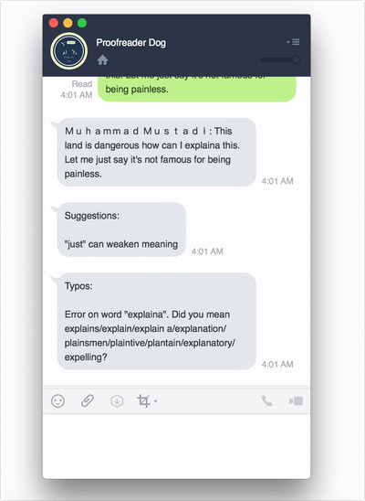

# proofreader-dog

> A simple LINE bot to proofread your texts.



## Deployment

Your own `proofreader-dog` is one click away:

[](https://deploy.now.sh/?repo=https://github.com/mathdroid/proofreader-dog)

You can also deploy with a single command from the terminal (assuming you have [`now`](https://now.sh) installed):

```sh
now mathdroid/micro-write-good
```

After you get the deployment url, put it in LINE's webhook URL.

## Usage

Send it a message in english, and it will look for suggestions based on `write-good`, and typographical errors based on `nodehun`.

## License

The MIT License (MIT)
Copyright (c) 2017 Muhammad Mustadi
